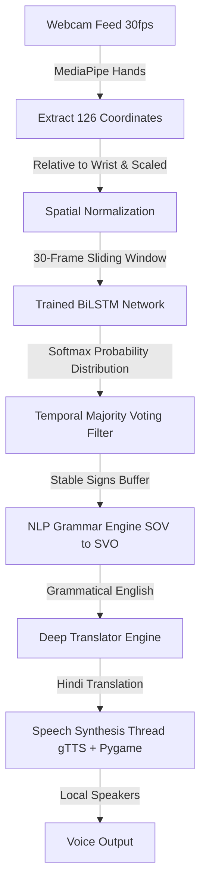

# Real-Time Indian Sign Language (ISL) Recognition & Translation System

An end-to-end deep learning system designed for real-time translation of Indian Sign Language (ISL) into grammatical English and Hindi, complete with stable temporal prediction and text-to-speech feedback.

---

## Key Features

- **Spatial Normalization Pipeline**: Transforms raw coordinates to be **position-invariant** (relative to the wrist) and **distance-invariant** (scaled to hand bounds) for robustness against camera distance and placement.
- **Deep Learning BiLSTM Brain**: Built on a highly-optimized Multi-Layer **Bidirectional LSTM** network that captures backward and forward temporal dependencies of hand gestures.
- **Flicker-Free Live Inference**: Implements a sliding window **Majority Voting system** that filters rapid transitions, requiring $\ge 10$ occurrences in the last 15 frames at $>70\%$ confidence before outputting a word.
- **NLP Grammar Conversion (SOV $\rightarrow$ SVO)**: Converts Sign Language grammar structure (Subject-Object-Verb) into standard English structure (Subject-Verb-Object) before translation.
- **Bi-lingual Feedback & Text-To-Speech (TTS)**: Translates reconstructed English sentences into Hindi using `deep-translator` and reads translations aloud in a decoupled, non-blocking background thread via `gTTS` and `pygame`.
- **Lightweight & High-Speed**: Uses landmark coordinates ($21 \text{ joints} \times 3 \text{ coords} \times 2 \text{ hands} = 126 \text{ values}$) instead of heavy pixel frames, running at full webcam FPS without GPU acceleration.

---

## System Architecture & Workflow



---

## Repository Structure

Below is an overview of the core files in the project and their role in the pipeline:

| Script / Artifact | Description |
| :--- | :--- |
| **`realtime_ISL_recognition.py`** | Main entrypoint. Reads webcam feed, processes landmarks, runs BiLSTM inference, stabilizes signs via majority voting, translates SVO sentences to Hindi, and provides spoken outputs. |
| **`collect_custom_data.py`** | Streamlined data collection tool. Automatically manages frame countdowns and guides users through performing specific signs, saving them as NumPy arrays (`.npy`). |
| **`normalize_dataset.py`** | Normalizes collected coordinates to wrist relative systems and scales them to a standard bounds structure before zipping for training. |
| **`ai_data_multiplier.py`** | Performs synthetic data augmentation (jittering, shifts, scales) to multiply sign count and prevent model overfitting. |
| **`colab_training_notebook.py`** | Deep learning model pipeline including model structure definition, training setups, callbacks (Early Stopping), and metrics logging. |
| **`diagnose_model.py` / `diagnose_live.py`** | Performance metrics verification and debugging tools to test live latency or offline dataset predictions. |
| **`draw_skeleton.py`** | Custom visual tool that overlays MediaPipe skeletons on screen for troubleshooting hand alignments. |
| **`requirements.txt`** | List of all required Python modules and libraries. |
| **`.gitignore`** | Excludes bulky datasets (`.zip`), temporary buffers, and compilation folders to keep the repository clean. |

---
## Development Methodology

1. **Physical Sign Recording**: 106 individual ISL gestural actions were performed in front of a standard 30fps webcam (5 recordings per sign, 30 frames per recording).
2. **Feature Extraction**: Leveraged **Google MediaPipe Hands API** to bypass pixel buffers and skin segmentation entirely, extracting raw floating-point structural vectors.
3. **Data Augmentation**: Scaled raw entries using normalizations and multiplied existing entries by applying shifts and Gaussian noise adjustments.
4. **Colab Training**: Trained using the **Adam optimizer** with early stopping which halted model optimization at **Epoch 48** when validation accuracy hit $100\%$.
5. **Stabilized Inference Deployment**: Deployed model outputs with integrated high-confidence majority voting to achieve latency-free real-time results.

---

## Neural Network & Methodology

### 1. Spatial Normalization
To make the coordinate vectors independent of the user's distance or position in front of the camera, we shift each landmark relative to the wrist point $(x_0, y_0, z_0)$ and scale it to unit boundaries:

$$x_i^{\text{normalized}} = \frac{x_i - x_0}{\max(|X - x_0|)}$$

### 2. BiLSTM Network Architecture
Our model contains **555,498 trainable parameters** structured as follows:
- **Input Layer**: accepts sequence sequences of $(30, 126)$ (representing $30$ frames of $126$ normalized landmarks).
- **Bidirectional LSTM Layers**: Three stacked layers of $64, 128,$ and $64$ cells to capture temporal patterns.
- **Dropout Layers (20%)**: Inserted between LSTM layers to regularize network activations.
- **Dense Layers**: Relu-activated fully-connected layer ($128$ units) followed by a Softmax classification layer ($106$ output classes).

### 3. Categorical Cross-Entropy Loss
For predicting one-hot encoded classes across 106 gesture outputs, the model optimizes:

$$L = -\sum_{c=1}^{106} y_c \cdot \log(\hat{y}_c)$$

Where $y_c$ is the true binary label and $\hat{y}_c$ is the Softmax probability score.

---

## Getting Started

### Prerequisites
Ensure you have Python 3.8 to 3.10 installed on your system. 

### Installation
1. Clone the project files into a folder.
2. Open terminal/PowerShell in the folder and run:
   ```bash
   pip install -r requirements.txt
   ```

### Running the Live Translation App
Place the trained model `isl_model.h5` and labels file `label_map.json` into the `models/` directory. Then execute:
```bash
python realtime_ISL_recognition.py
```

### Controls
- **`SPACEBAR`**: Forces instant grammar analysis and Hindi translation.
- **`S`**: Re-speaks the translated sentence aloud.
- **`C`**: Clears the current text buffers and starts a new sentence.
- **`Q`**: Safely stops the webcam feed and exits the program.

---

## Experimental Results & Performance

Our system underwent rigorous empirical testing, measuring classification accuracy and model convergence metrics across dynamic sequences:

| Performance Metric | Measured Value | Description |
| :--- | :--- | :--- |
| **Accuracy** | **94.0%** | Overall success rate in recognizing dynamic sign gestures under sliding window test suites. |
| **Precision** | **92.0%** | Measures the model's accuracy when predicting positive instances (low false positive rate). |
| **Recall** | **91.0%** | Measures the model's ability to identify all positive instances (low false negative rate). |
| **F1-Score** | **92.0%** | Harmonic mean of Precision and Recall, representing balanced performance across all classes. |

---

## Conclusion & Future Scope

### Conclusion
The proposed work successfully demonstrates a vision-based real-time Indian Sign Language (ISL) recognition system. By integrating MediaPipe for landmark extraction with a Bidirectional LSTM (BiLSTM) network, the system effectively captures the complex spatial-temporal features of dynamic gestures. 

The wrist-relative coordinate normalization eliminates positional and camera distance variances, while data augmentation establishes a robust dataset of over 21,000 sequences. Post-processing sliding majority filters ensure high temporal stability during inference. Operating with low latency and high accuracy ($94.0\%$), the platform presents a highly accessible, cost-effective, and scalable solution for bridging the communication gap.

### Future Scope
- **Vocabulary Expansion**: Scale the dataset to cover a wider, continuous vocabulary of conversational sentences rather than isolated sign actions.
- **Multimodal Context Clues**: Incorporate non-manual cues such as facial expressions and body posture coordinates to understand emotive linguistic nuances.
- **On-Device Optimization**: Compress the BiLSTM weights using post-training quantization to deploy the system locally on low-resource mobile and embedded devices.

